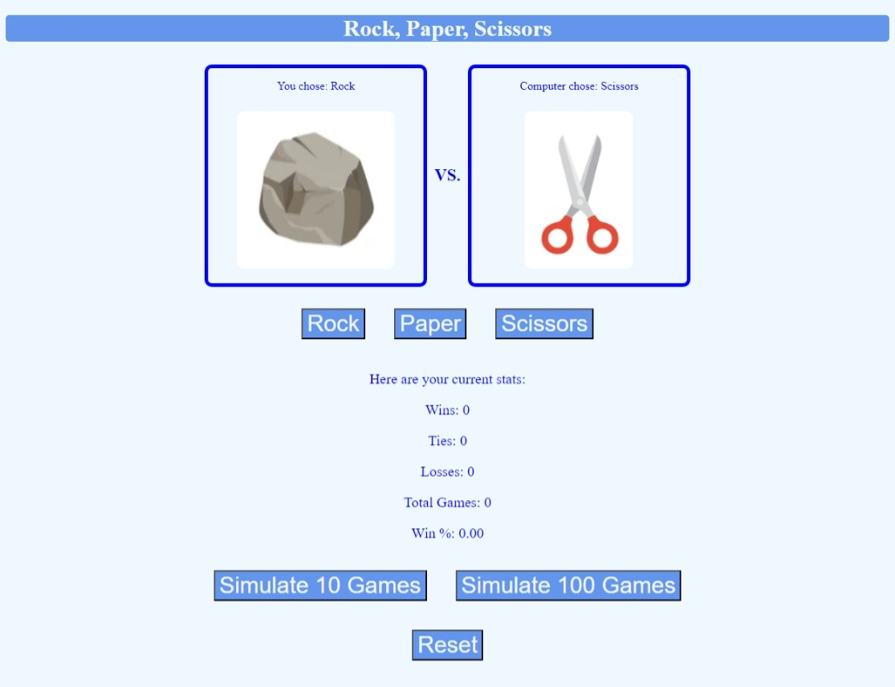

# Rock Paper Scissors

## Description

This is a simple game of rock paper scissors that anyone can play on the web against the computer. Players can choose rock, paper, or scissors and see how it matches against the random selection from the computer. It keeps track of wins, ties, and losses to calculate an overall win percentage.

For players who would rather see the long term win rate of the game, there are simulation buttons that will run either 10 or 100 games automatically with random selections on both sides. Over time, the win rate approaches 1/3, as expected when there are 3 ways each to win, lose, or tie.

The game uses a linked list implementation so that the number of checks and comparisons in each game is minimized. With the linked list, there will be a maximum of 3 comparisons in the worst case scenario, as opposed to the maximum of 7 comparisons when exclusively if statements are used. There is a little extra time taken to set up the linked list, while if statements require virtually no setup. Since the linked list is short and only needs to be generated once, I think that the long term payoff is worth the extra setup time.

## Usage

Players simply need to click the appropriate button to either play a game or simulate several. There is a reset button included to reset all the statistics to 0.

## Visual

## URLs

Github Repository: https://github.com/Shippo704/Rock-Paper-Scissors

Deployed Webpage: https://shippo704.github.io/Rock-Paper-Scissors